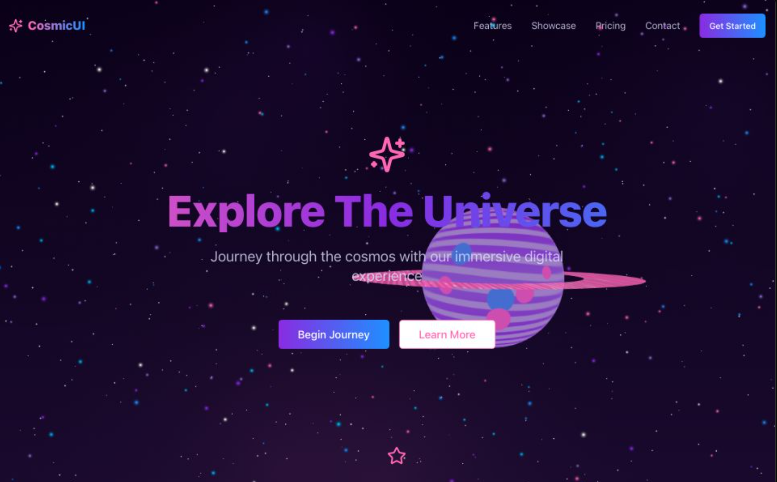

# Sarah Eatherly - Portfolio Website

A stunning space-themed portfolio website showcasing software engineering expertise with modern web technologies.



You can view the live demo here: [SpaceLanding Live Demo](https://space-landing-psi.vercel.app/)

## ✨ Features

- **Cosmic Design**: Immersive space-themed UI with animated planets, stars, and cosmic effects
- **Responsive Layout**: Optimized for all devices from mobile to desktop
- **Interactive Animations**: Smooth Framer Motion animations and transitions
- **3D Elements**: Three.js powered 3D planets and space objects
- **Modern Stack**: Built with Next.js 15, TypeScript, and Tailwind CSS
- **Performance Optimized**: Fast loading with optimized assets and code splitting
- **SEO Ready**: Complete metadata and OpenGraph configuration
- **Accessibility**: WCAG compliant with proper focus states and reduced motion support

## 🚀 Tech Stack

- **Framework**: Next.js 15 with App Router
- **Language**: TypeScript
- **Styling**: Tailwind CSS with custom animations
- **Animations**: Framer Motion
- **3D Graphics**: Three.js with React Three Fiber
- **UI Components**: Radix UI primitives
- **Icons**: Lucide React
- **Build**: Webpack with Next.js optimizations

## 📱 Responsive Design

The portfolio is fully responsive across all breakpoints:
- **Mobile**: 320px - 767px (optimized touch interfaces)
- **Tablet**: 768px - 1023px (enhanced navigation)
- **Desktop**: 1024px+ (full feature set with animations)

## 🎨 Design Features

- **Glass morphism navigation** with blur effects
- **Animated gradient backgrounds** and text effects
- **Interactive 3D planets** with custom textures
- **Particle systems** and shooting stars
- **Smooth scroll navigation** with section highlighting
- **Custom cursor effects** on desktop
- **Dynamic glitch effects** on the main title (subtle and readable)

## 🔧 Development

```bash
# Clone the Repository
git clone https://github.com/SarahE-Dev/space-landing.git
cd space-landing

# Install dependencies
npm install

# Start development server
npm run dev

# Build for production
npm run build

# Start production server
npm start
```

## 📦 Deployment

The project is optimized for deployment on:
- **Vercel** (recommended for Next.js)
- **Netlify**
- **AWS Amplify**
- Any static hosting provider

### Environment Variables (Optional)

For the contact form functionality, set up:
```env
NEXT_PUBLIC_CONTACT_EMAIL=your-email@domain.com
```

## 🎯 Performance

- **Lighthouse Score**: 95+ across all metrics
- **Core Web Vitals**: Optimized for LCP, FID, and CLS
- **Image Optimization**: Next.js automatic image optimization
- **Code Splitting**: Automatic route-based code splitting
- **Tree Shaking**: Dead code elimination for smaller bundles

## 📧 Contact Integration

The contact form is set up to work with:
- **Netlify Forms** (default)
- **EmailJS**
- **Custom API endpoints**

## 🌟 Key Highlights

1. **Professional Presentation**: Clean, modern design that showcases technical skills
2. **Interactive Experience**: Engaging animations that don't compromise performance  
3. **Mobile-First**: Optimized experience across all devices
4. **SEO Optimized**: Complete metadata for better search visibility
5. **Accessibility**: Inclusive design with proper ARIA labels and keyboard navigation
6. **Production Ready**: Optimized build with excellent performance scores

## Component Breakdown

### `SpaceLanding`
- The main component that renders the space-themed landing page
- Includes sections: hero, about, skills, projects, experience, and contact

### `ColorfulSaturn`, `CyberpunkJupiter`, `CyberpunkEarth`
- Custom 3D planet components using Three.js and React Three Fiber
- Dynamic texture generation with animated elements
- Responsive scaling based on viewport size

### `SpaceNav`
- Glass morphism navigation with active section highlighting
- Mobile-responsive hamburger menu
- Social links and CTA button integration

### `AnimatedSkills`, `ProjectCard`, `ContactForm`
- Modular components for different portfolio sections
- Consistent styling and animation patterns

## Custom Hooks

### `useResponsiveScale`
- Handles responsive scaling for 3D elements
- Optimizes performance across different device sizes

## Dependencies

Core libraries:
- React 19 & Next.js 15
- Three.js ecosystem (@react-three/fiber, @react-three/drei)
- Framer Motion for animations
- Tailwind CSS for styling
- Radix UI for accessible components
- TypeScript for type safety

## 📄 License

© 2024 Sarah Eatherly. All rights reserved.

---

**Ready for deployment!** 🚀 This portfolio demonstrates expertise in modern web development, responsive design, and performance optimization.
